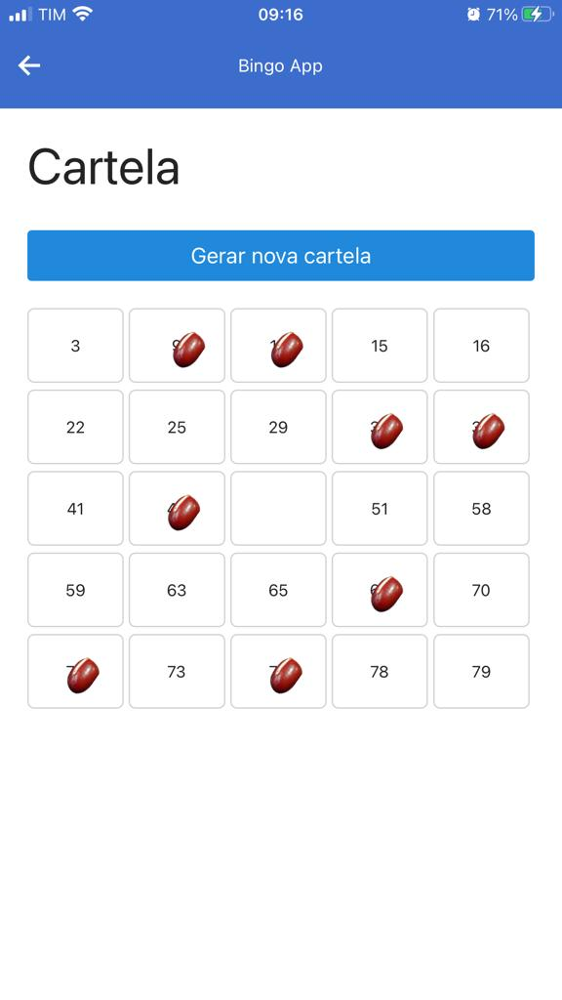
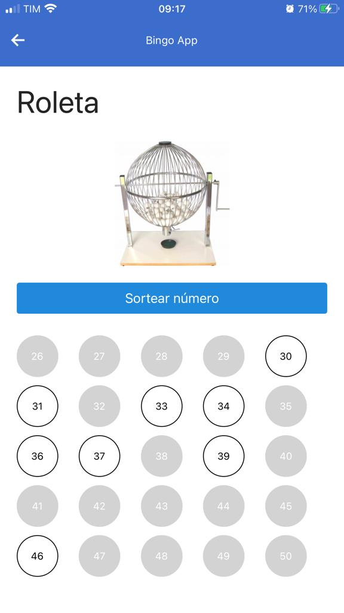
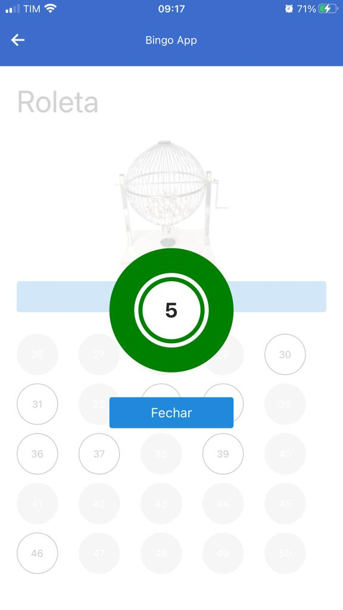

# Bingo App

Bingo app is a mobile app to play bingo game that has cards and a roulette. The app was developed with React Native.

- [Screens](#screens)
- [Running the project](#running-the-project)
  - [Prerequisites](#prerequisites)
  - [Instalation](#instalation)
  - [Start](#start)
- [Project structure](#project-structure)
  - [/assets](#assets)
  - [/components](#components)
  - [/node_modules](#node_modules)
- [Author](#author)

## Screens

<p float="left">
  
  

  

  

  

  

</p>

## Running the project

Follow the instructions below to copy the project and run locally.

### Prerequisites

As prerequisites to run the project is needed to have Node.js, the package manager NPM and Expo CLI installed in you machine.

### Instalation

Clone the project with the command:

```sh
$ git clone https://github.com/alexisbarros/bingo.git
```

Go to the created folder:

```sh
$ cd bingo
```

Install all dependencies:

```sh
$ npm install
```

### Start

Start the project using expo cli:

```sh
$ expo start
```

To test in a device, you need to install expo client in the device and read the QR code generate in the terminal after expo start finish.

## Project structure

The project is structured as follows:

```
bingo/
  assets/
    imgs/
  components/
    cart/
    home/
    how-to-play/
    roulette/
  node_modules/
  App.js
  app.json
  index.js
  package.json
  README.md
```

Below is a breakdown of some project directories.

### /assets

Contains all images files of the project.

### /components

Contains the files responsible for creating the screen components.

### /node_modules

Contains all the modules installed by NPM.

## Author

Alexis Barros
